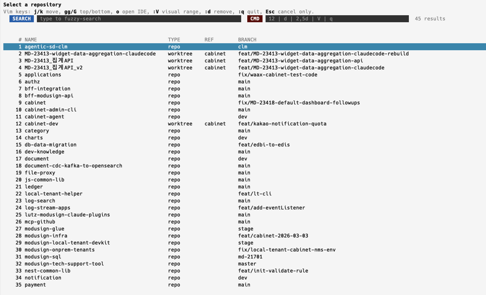

# repo

configured paths 아래의 GitHub repository 와 worktree 를 찾아서 리스트/선택하는 CLI 앱.

## 스크린샷



## 설치법

앱 디렉터리에서 직접 실행:

```bash
cd apps/repo
npm run start -- list
npm run start -- --query cabinet
npm run start -- --json
```

현재 셸에서 선택 후 바로 `cd` 되게 쓰려면 shell wrapper 를 한 번 로드:

```bash
source /Users/lutz/projects/myaerocode/dailylife-utils/apps/repo/shell/repo.zsh
```

이후:

```bash
repo
repo list
repo --query cabinet
repo --json
```

## 준비물

- `node`: 앱 실행용
- `npm`: `npm run start` 실행용
- `git`: worktree 제거 처리용
- `code` 또는 원하는 IDE CLI: `o` / `:o`로 IDE 열기 기능 사용 시 필요
- GitHub remote 가 설정된 로컬 repository: `origin` 이 GitHub 인 repo만 목록에 포함됨

## 설정 파일 설명

기본 설정 파일 경로:

[`apps/repo/config/repo-paths.json`](/Users/lutz/projects/myaerocode/dailylife-utils/apps/repo/config/repo-paths.json)

기본 형태:

```json
{
  "ide": {
    "command": "code",
    "args": ["-r"]
  },
  "paths": [
    "~/projects",
    "~/projects/modusign/agentic-sd-clm/worktrees"
  ]
}
```

필드 설명:

- `paths`: 스캔할 루트 디렉터리 목록
- `ide.command`: IDE 실행 커맨드
- `ide.args`: IDE 실행 인자 목록. `{path}`를 넣으면 선택된 repo 경로로 치환됨

동작 규칙:

- 없는 path 는 실패시키지 않고 warning 만 출력하고 건너뜀
- `ide`를 문자열로도 줄 수 있음. 예: `"ide": "code"`
- `ide.args`에 `{path}`가 없으면 선택된 repo 경로를 마지막 인자로 자동 추가함

추가 인자가 필요하면:

```json
{
  "ide": {
    "command": "code",
    "args": ["--reuse-window", "{path}"]
  },
  "paths": ["~/projects"]
}
```

## 동작 설명

기본 동작:

- configured path 아래를 재귀 스캔해서 `.git`이 있는 디렉터리를 찾음
- GitHub origin 을 가진 repo만 목록에 포함함
- 일반 repo 와 worktree 를 함께 표시함
- 정렬은 항상 실제 `PATH` 기준으로 유지됨
- interactive UI 에서는 `NAME`, `TYPE`, `REF`, `BRANCH` 컬럼으로 표시함
- `worktree`의 `REF`는 원본 repo 이름, 일반 `repo`의 `REF`는 비어 있음

비대화형 사용:

- `repo list`: 전체 목록 출력
- `repo --json`: 첫 매칭 결과를 JSON 으로 출력
- `repo --plain`: 첫 매칭 path 만 출력
- `repo --index <n>`: 필터 후 n번째 항목 선택
- `repo --query <text>`: fuzzy search 적용

대화형 사용:

- `j` / `k`, `↑` / `↓`: 이동
- `gg` / `G`: 맨 위 / 맨 아래 이동
- 바로 타이핑: 검색 시작
- `/`: 검색 모드 진입
- `:12`: 12번째 항목으로 이동
- `:V`: visual line selection 시작
- `d` 또는 `:d`: 삭제 confirm
- `:2,5d`: 범위 삭제
- `o` 또는 `:o`: 현재 포커스된 항목을 configured IDE 로 열기
- `Enter`: 현재 항목 선택 후 shell wrapper 사용 시 해당 디렉터리로 이동
- `:q`: 종료

삭제 동작:

- 일반 repo 는 디렉터리를 제거함
- worktree 는 `git worktree remove --force`로 제거함
- 삭제는 background worker 에서 실행되어 UI 대기를 최소화함
